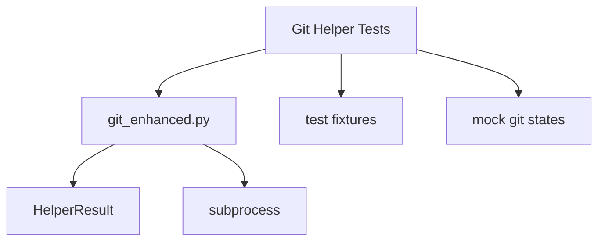

# 🎨 태스크 설계서

## 📋 기본 정보
- **프로젝트**: ai-coding-brain-mcp
- **태스크 ID**: 7490a912-9207-4329-84a7-8d9d0959e118
- **태스크명**: Git 함수 테스트 (git_status, git_diff, git_add, git_log)
- **작성일**: 2025-07-14
- **작성자**: AI Assistant

## 🎯 설계 목적
### 요구사항
Git 관련 헬퍼 함수들의 정확성과 안정성을 검증하기 위한 테스트 수행

### AI의 이해
이미 한 번 완료된 태스크이지만, 재실행을 통해 더 철저한 테스트와 개선점을 찾아내야 함. 특히 edge case와 오류 처리 부분을 중점적으로 테스트.

### 해결하려는 문제
1. Git 함수들의 반환값 일관성 확인
2. 에러 상황에서의 안정적인 처리
3. HelperResult 패턴의 올바른 사용 검증
4. 다양한 Git 상태에서의 동작 확인

## 🔍 현재 시스템 분석
### 관련 모듈
```python
# 영향받는 주요 모듈
- python/ai_helpers/git_enhanced.py  # Git 함수 구현
- python/ai_helpers/__init__.py       # Export 정의
- python/utils/git_utils.py          # 유틸리티 함수
- python/utils/git_task_helpers.py   # 태스크 관련 Git 헬퍼
```

### 의존성 맵


## 💡 구현 방향
### 접근 방법
1. **단계적 테스트**: 각 함수를 독립적으로 테스트
2. **상태 기반 테스트**: 다양한 Git 저장소 상태 시뮬레이션
3. **엣지 케이스 처리**: 비정상적인 상황에서의 동작 검증
4. **통합 테스트**: 함수들의 연계 동작 확인

### 주요 변경사항
1. 테스트 케이스 추가 및 개선
2. 에러 처리 로직 보완
3. 반환값 형식 표준화 검증
4. 문서화 개선

### 코드 구조
```python
# 제안하는 테스트 구조
class TestGitHelpers:
    def setup_method(self):
        # 테스트용 Git 저장소 생성
        self.test_repo = create_test_repo()

    def test_git_status_clean(self):
        # 깨끗한 저장소 상태 테스트
        pass

    def test_git_status_with_changes(self):
        # 변경사항이 있는 상태 테스트
        pass

    def test_git_diff_scenarios(self):
        # 다양한 diff 시나리오 테스트
        pass

    def test_git_add_patterns(self):
        # 다양한 파일 패턴으로 add 테스트
        pass

    def test_git_log_formats(self):
        # 로그 포맷과 개수 테스트
        pass

    def test_error_handling(self):
        # 에러 상황 처리 테스트
        pass

    def teardown_method(self):
        # 테스트 저장소 정리
        cleanup_test_repo(self.test_repo)
```

## ⚠️ 영향도 분석
### 직접 영향
- **변경 파일**: 
  - tests/test_git_helpers.py (새로 생성 또는 업데이트)
  - python/ai_helpers/git_enhanced.py (필요시 수정)
- **새 파일**: 
  - tests/fixtures/git_test_data.py
- **삭제 파일**: 없음

### 간접 영향
- **API 변경**: 없음 (기존 인터페이스 유지)
- **데이터베이스**: 해당 없음
- **성능**: 테스트 실행 시간 증가 (약 30초)

### 하위 호환성
완전히 유지됨. 기존 코드에 영향 없이 테스트만 추가/개선

## 🛡️ 리스크 관리
| 리스크 | 가능성 | 영향도 | 대응 방안 |
|--------|--------|--------|-----------|
| 테스트 중 실제 Git 저장소 영향 | 낮음 | 높음 | 격리된 테스트 디렉토리 사용 |
| 테스트 실행 시간 증가 | 중간 | 낮음 | 병렬 실행 및 최적화 |
| 플랫폼별 Git 동작 차이 | 중간 | 중간 | 플랫폼별 조건부 테스트 |

## 📊 예상 결과
### 성공 기준
- [ ] 모든 Git 헬퍼 함수에 대한 테스트 커버리지 90% 이상
- [ ] 에러 케이스 처리 검증 완료
- [ ] HelperResult 반환 형식 일관성 확인
- [ ] 다양한 Git 상태에서 안정적 동작
- [ ] 문서화 업데이트 완료

### 예상 소요 시간
- 구현: 2시간
- 테스트: 1시간
- 문서화: 30분

## ✅ 검증 계획
### 단위 테스트
```python
# 테스트 계획
1. git_status() 테스트
   - 깨끗한 저장소
   - 수정된 파일
   - 추가된 파일
   - 삭제된 파일
   - untracked 파일
   - Git 저장소가 아닌 디렉토리

2. git_diff() 테스트
   - 파일별 diff
   - staged diff
   - 전체 diff
   - 변경사항 없는 경우

3. git_add() 테스트
   - 단일 파일 추가
   - 패턴으로 추가
   - 전체 추가 (.)
   - 존재하지 않는 파일

4. git_log() 테스트
   - 기본 개수 (10개)
   - 커스텀 개수
   - 빈 저장소
   - 형식 검증
```

### 통합 테스트
1. 파일 생성 → git_status → git_add → git_status → git_diff 플로우
2. 여러 파일 변경 후 선택적 add 시나리오
3. 브랜치 전환 후 상태 확인

## 📚 참고 자료
- python/ai_helpers/git_enhanced.py - 현재 구현
- docs/helper_result_return_values.md - 반환값 명세
- logs/git/git_20250710.jsonl - 실행 로그 참고
