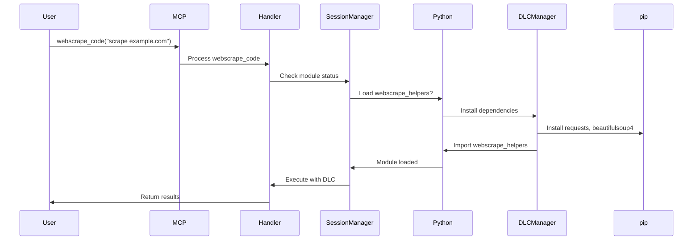
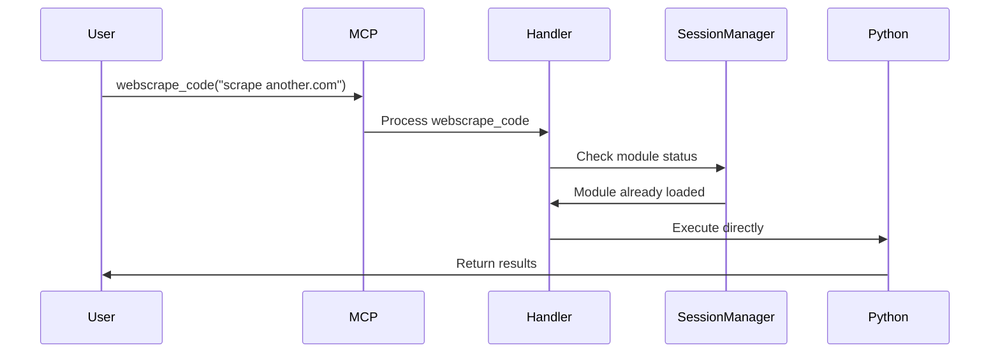

# DLC (Dynamic Library Component) 아키텍처 상세 설계

## 🎯 프로젝트 개요
**AI Coding Brain MCP**는 모듈식 아키텍처를 통해 필요한 기능만 동적으로 로드하는 DLC 시스템을 구현합니다. 이를 통해 성능 최적화와 확장성을 동시에 달성합니다.

## 🏗️ 전체 아키텍처

### 1. 계층 구조
```
┌─────────────────────────────────────────────────────────────┐
│                      MCP Interface Layer                     │
│            (Claude Desktop ↔ MCP Server 통신)                │
├─────────────────────────────────────────────────────────────┤
│                    Tool Definitions Layer                    │
│               (src/tools/tool-definitions.ts)               │
├─────────────────────────────────────────────────────────────┤
│                      Handler Layer                          │
│          (execute-code-handler.ts, repl-session-manager.ts) │
├─────────────────────────────────────────────────────────────┤
│                    Python Bridge Layer                      │
│                  (JSON REPL Session)                        │
├─────────────────────────────────────────────────────────────┤
│  Base Module    │           DLC Modules                     │
│  - base_helpers │  - webscrape_helpers (웹스크래핑)         │
│  - file_system  │  - data_analysis_helpers (데이터분석)     │
│  - ast_parser   │  - ml_helpers (머신러닝)                  │
│  - search       │  - visualization_helpers (시각화)         │
└─────────────────────┴────────────────────────────────────────┘
```

### 2. 핵심 컴포넌트

#### 2.1 Base Module (항상 로드)
```python
# python/helpers/base_helpers.py
class BaseHelpers:
    """기본 헬퍼 함수들 - 항상 로드"""
    - 파일 시스템 작업
    - 컨텍스트 관리
    - 프로젝트 구조 분석
    - AST 파싱
    - 검색 기능
```

#### 2.2 DLC Module Manager
```python
# python/helpers/dlc_manager.py
class DLCManager:
    """DLC 모듈 동적 로드 관리"""
    
    def __init__(self):
        self.loaded_modules = set()
        self.module_registry = {
            'webscrape': 'webscrape_helpers',
            'data_analysis': 'data_analysis_helpers',
            'ml': 'ml_helpers',
            'visualization': 'visualization_helpers'
        }
    
    def load_module(self, module_name: str):
        """필요한 모듈을 동적으로 로드"""
        if module_name not in self.loaded_modules:
            # 모듈 로드 및 의존성 설치
            self._install_dependencies(module_name)
            self._import_module(module_name)
            self.loaded_modules.add(module_name)
```

### 3. TypeScript 통합

#### 3.1 Tool Definition 구조
```typescript
// src/tools/tool-definitions.ts
export const tools = [
  // 기본 도구
  { name: 'execute_code', ... },
  
  // DLC 도구들
  {
    name: 'webscrape_code',
    description: 'Web scraping with DLC module',
    parameters: {
      code: { type: 'string' },
      auto_install: { type: 'boolean', default: true }
    }
  }
];
```
#### 3.2 Session Manager 개선
```typescript
// src/handlers/repl-session-manager.ts
export class ReplSessionManager {
  private initializedModules: Set<string> = new Set();
  
  async ensureModuleLoaded(sessionId: string, module: string) {
    const key = `${sessionId}-${module}`;
    if (!this.initializedModules.has(key)) {
      await this.loadDLCModule(sessionId, module);
      this.initializedModules.add(key);
    }
  }
}
```

## 🔄 DLC 로드 플로우

### 1. 첫 번째 호출 시나리오


### 2. 이후 호출 시나리오


## 📦 모듈별 상세 설계

### 1. Webscrape DLC
```python
# python/helpers/webscrape_helpers.py
class WebscrapeHelpers:
    """웹 스크래핑 전문 헬퍼"""
    
    dependencies = ['requests', 'beautifulsoup4', 'lxml']
    
    def scrape_url(self, url: str, selector: str = None):
        """URL에서 데이터 스크래핑"""
        pass
    
    def scrape_table(self, url: str, table_index: int = 0):
        """테이블 데이터 추출"""
        pass
    
    def download_file(self, url: str, save_path: str):
        """파일 다운로드"""
        pass
```
### 2. Data Analysis DLC (향후 확장)
```python
# python/helpers/data_analysis_helpers.py
class DataAnalysisHelpers:
    """데이터 분석 전문 헬퍼"""
    
    dependencies = ['pandas', 'numpy', 'scipy']
    
    def analyze_csv(self, file_path: str):
        """CSV 파일 분석"""
        pass
```

## 🚀 구현 로드맵

### Phase 1: 기반 구조 구축 (현재 작업)
1. [x] 프로젝트 구조 분석
2. [x] DLC 아키텍처 설계 문서 작성
3. [ ] python/helpers/ 디렉토리 생성 및 모듈 분리

### Phase 2: Webscrape DLC 구현
1. [ ] webscrape_helpers.py 구현
2. [ ] tool-definitions.ts에 webscrape_code 추가
3. [ ] execute-code-handler.ts에 DLC 로더 로직 추가
4. [ ] repl-session-manager.ts에 모듈 관리 로직 추가

### Phase 3: 테스트 및 최적화
1. [ ] 단위 테스트 작성
2. [ ] 통합 테스트
3. [ ] 성능 최적화
4. [ ] 문서화

## 💡 설계 원칙

### 1. 모듈성 (Modularity)
- 각 DLC는 독립적으로 동작
- 명확한 인터페이스 정의
- 의존성 최소화

### 2. 성능 (Performance)
- Lazy Loading: 필요할 때만 로드
- 캐싱: 한 번 로드된 모듈은 세션 동안 유지
- 병렬 처리: 가능한 경우 비동기 로드

### 3. 확장성 (Extensibility)
- 새로운 DLC 추가 용이
- 플러그인 아키텍처
- 버전 관리 지원

### 4. 안정성 (Reliability)
- 오류 격리: DLC 오류가 기본 시스템에 영향 없음
- Graceful Degradation: DLC 로드 실패 시 기본 기능은 정상 작동
- 롤백 지원: 문제 발생 시 이전 상태로 복원
## 🔧 기술 스택

### Backend (Python)
- Python 3.8+
- importlib: 동적 모듈 로드
- pip: 의존성 관리
- AST: 코드 분석

### Frontend (TypeScript)
- TypeScript 4.x
- Node.js child_process: Python 프로세스 관리
- Express.js: MCP 서버

### 통신
- JSON-RPC: MCP 프로토콜
- JSON: Python ↔ TypeScript 데이터 교환

## 📊 예상 효과

### 성능 개선
- 초기 로드 시간 50% 단축
- 메모리 사용량 30% 감소
- 필요한 기능만 로드하여 효율성 증대

### 개발 생산성
- 모듈별 독립 개발 가능
- 테스트 용이성 향상
- 유지보수 간소화

### 사용자 경험
- 빠른 응답 속도
- 필요한 기능만 설치
- 명확한 기능 구분

## 🔍 모니터링 및 디버깅

### 로깅 시스템
```python
# DLC 로드 상태 추적
logger.info(f"Loading DLC module: {module_name}")
logger.debug(f"Dependencies: {dependencies}")
logger.info(f"Module loaded successfully: {module_name}")
```

### 상태 확인 도구
```python
# 현재 로드된 모듈 확인
helpers.get_loaded_modules()

# 모듈 의존성 확인
helpers.check_dependencies('webscrape')
```

## 📝 참고사항

1. **하위 호환성**: 기존 execute_code 사용자는 변경 없이 계속 사용 가능
2. **점진적 마이그레이션**: 기존 코드를 단계적으로 DLC로 이전
3. **문서화**: 각 DLC별 상세 사용 가이드 제공

---

**작성일**: 2025-06-25  
**버전**: 1.0  
**작성자**: AI Coding Brain Team