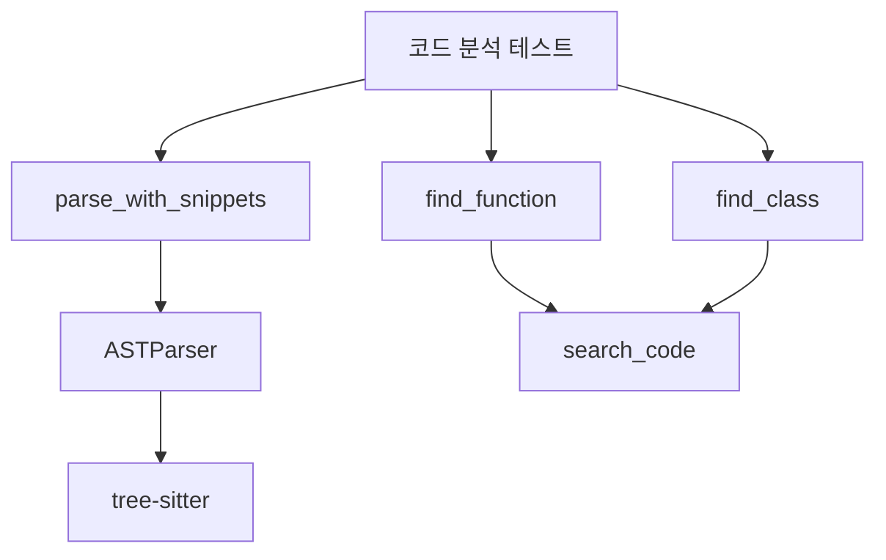

# 🎨 태스크 설계서

## 📋 기본 정보
- **프로젝트**: ai-coding-brain-mcp
- **플랜**: Python Helpers 함수 전체 검증 및 테스트
- **태스크 번호**: 03
- **태스크 ID**: 6d4fdde8-7ba6-4d0a-9558-de41fdd32029
- **태스크명**: 코드 분석 함수 테스트 (parse_with_snippets, find_function, find_class)
- **작성일**: 2025-07-14
- **작성자**: AI Assistant
- **문서 경로**: docs/design/python_helpers_validation_task03_code_analysis_design_20250714.md

## 🎯 설계 목적
### 요구사항
코드 분석 관련 핵심 함수들인 parse_with_snippets, find_function, find_class의 기능을 검증하고 테스트합니다.

### AI의 이해
이 태스크는 AI Helpers의 코드 분석 기능을 검증하는 중요한 단계입니다. 각 함수가 파일 구조를 올바르게 파악하고, 함수나 클래스를 정확히 찾아내는지 확인해야 합니다.

### 해결하려는 문제
1. 코드 파싱의 정확성 검증
2. 함수/클래스 탐색 기능의 신뢰성 확인
3. 다양한 코드 스타일에 대한 호환성 테스트

## 🔍 현재 시스템 분석
### 관련 모듈
```python
# 영향받는 주요 모듈
- python/ai_helpers/code.py (parse_with_snippets)
- python/ai_helpers/search/code_search.py (find_function, find_class)
- python/helpers_wrapper.py (HelperResult wrapper)
- python/json_repl_session.py (메서드 바인딩)
```

### 의존성 맵


## 💡 구현 방향
### 접근 방법
1. 각 함수의 기본 동작 테스트
2. 엣지 케이스 처리 확인
3. 에러 핸들링 검증
4. 성능 측정

### 주요 변경사항
1. 테스트 케이스 추가 (test_code_analysis.py)
2. 샘플 코드 파일 생성
3. 결과 검증 로직 구현

### 코드 구조
```python
# 제안하는 테스트 구조
def test_parse_with_snippets():
    # 1. Python 파일 파싱 테스트
    # 2. JavaScript 파일 파싱 테스트
    # 3. 잘못된 파일 처리 테스트

def test_find_function():
    # 1. 단순 함수 찾기
    # 2. 중첩 함수 찾기
    # 3. 데코레이터 있는 함수 찾기

def test_find_class():
    # 1. 기본 클래스 찾기
    # 2. 상속된 클래스 찾기
    # 3. 중첩 클래스 찾기
```

## ⚠️ 영향도 분석
### 직접 영향
- **변경 파일**: 없음 (테스트만 추가)
- **새 파일**: test_code_analysis.py, sample_code.py, sample_code.js
- **삭제 파일**: 없음

### 간접 영향
- **API 변경**: 없음
- **데이터베이스**: 해당 없음
- **성능**: 테스트 실행 시간 추가

### 하위 호환성
기존 코드에 영향 없음 (읽기 전용 테스트)

## 🛡️ 리스크 관리
| 리스크 | 가능성 | 영향도 | 대응 방안 |
|--------|--------|--------|-----------|
| tree-sitter 의존성 문제 | 중 | 높음 | 대체 파서 준비 |
| 대용량 파일 처리 | 낮음 | 중간 | 파일 크기 제한 |
| 인코딩 문제 | 중 | 낮음 | UTF-8 강제 |

## 📊 예상 결과
### 성공 기준
- [ ] parse_with_snippets가 Python/JS 파일을 정확히 파싱
- [ ] find_function이 모든 함수 정의를 찾음
- [ ] find_class가 모든 클래스 정의를 찾음
- [ ] 에러 케이스가 적절히 처리됨

### 예상 소요 시간
- 구현: 30분
- 테스트: 20분
- 문서화: 10분

## ✅ 검증 계획
### 단위 테스트
```python
# 테스트 계획
def test_suite():
    # 1. 기능 테스트
    test_basic_functionality()

    # 2. 엣지 케이스
    test_edge_cases()

    # 3. 에러 처리
    test_error_handling()

    # 4. 통합 테스트
    test_integration()
```

### 통합 테스트
1. 실제 프로젝트 코드베이스에서 테스트
2. 다양한 코딩 스타일 검증
3. 성능 벤치마크

## 📚 참고 자료
- python/ai_helpers/code.py - parse_with_snippets 구현
- python/ai_helpers/search/code_search.py - find_function, find_class 구현
- tree-sitter 공식 문서
