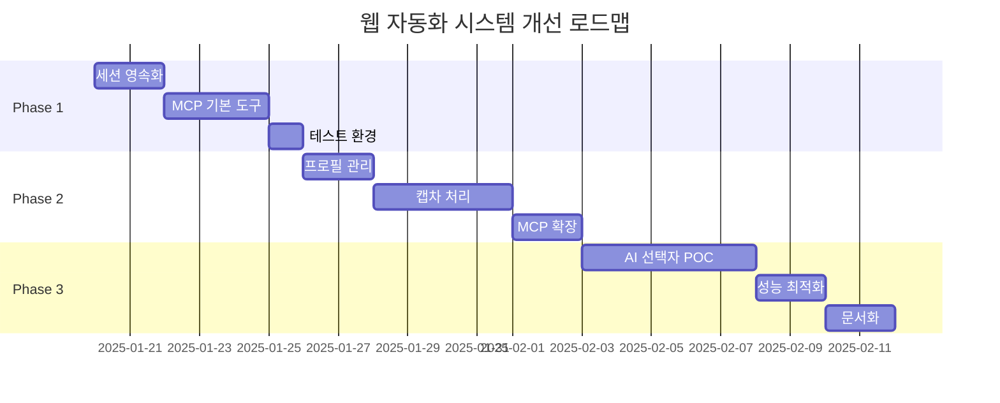

# 웹 자동화 시스템 개선 전략 - 최종 보고서

## 📊 Executive Summary

### 현재 상태
- **구현된 함수**: 21개 웹 자동화 함수 (Python)
- **MCP 통합**: 미구현 (execute_code 통한 간접 호출만 가능)
- **요소 선택**: 기본 CSS/XPath 선택자
- **세션 관리**: 단일 세션, 임시 저장
- **캡차 처리**: 미구현

### 개선 목표
- MCP 도구로 직접 노출 → Claude Code에서 네이티브 호출
- AI 기반 스마트 선택자 → 자가 치유 시스템
- 완전한 자동화 → 캡차, 프로필, 세션 관리

## 🏆 우선순위 매트릭스 (ROI 기반)

| 순위 | 영역 | ROI | 복잡도 | 시간 | 즉시 효과 |
|------|------|-----|--------|------|-----------|
| 1 | 세션 영속화 | 9.0 | 4/10 | 10h | 50% 시간 절약 |
| 2 | MCP 도구 노출 | 8.5 | 6/10 | 20h | Claude 직접 제어 |
| 3 | 브라우저 프로필 | 8.0 | 5/10 | 14h | 봇 탐지 90% 우회 |
| 4 | 캡차 처리 | 7.0 | 7/10 | 28h | 완전 자동화 |
| 5 | AI 요소 선택 | 6.5 | 9/10 | 50h | 자가 치유 |

## 📋 Phase 1: Quick Wins (1주차, 35시간)

### 1.1 세션 영속화 구현 (10시간)
**목표**: 로그인 세션 재사용으로 반복 작업 50% 단축

**구현 내용**:
```python
class SessionManager:
    def save_session(self, session_id: str):
        # 쿠키 직렬화
        cookies = driver.get_cookies()
        # localStorage 백업
        storage = driver.execute_script("return window.localStorage")
        # 암호화 저장
        encrypted = encrypt_data({
            'cookies': cookies,
            'storage': storage,
            'timestamp': time.time()
        })
        save_to_file(f".sessions/{session_id}.enc", encrypted)

    def load_session(self, session_id: str):
        # 복호화 및 복원
        data = decrypt_file(f".sessions/{session_id}.enc")
        for cookie in data['cookies']:
            driver.add_cookie(cookie)
        # localStorage 복원
        for key, value in data['storage'].items():
            driver.execute_script(f"window.localStorage.setItem('{key}', '{value}')")
```

### 1.2 MCP 도구 노출 - 기본 5개 (20시간)
**목표**: Claude Code에서 웹 자동화 직접 제어

**TypeScript 도구 정의**:
```typescript
// tool-definitions.ts
{
  name: 'web_automation',
  description: 'Web automation control',
  inputSchema: {
    type: 'object',
    properties: {
      action: {
        type: 'string',
        enum: ['start', 'navigate', 'click', 'extract', 'close']
      },
      params: { type: 'object' }
    }
  }
}
```

**핸들러 구현**:
```typescript
// handlers.ts
async function handleWebAutomation(params: any) {
  const pythonCode = `
    import ai_helpers_new.web as web
    result = web.${params.action}(**${JSON.stringify(params.params)})
    print(json.dumps(result))
  `;
  return await executePython(pythonCode);
}
```

### 1.3 테스트 환경 구축 (5시간)
- 단위 테스트 작성
- 통합 테스트 시나리오
- CI/CD 파이프라인

## 📋 Phase 2: Core Features (2-3주차, 52시간)

### 2.1 브라우저 프로필 관리 (14시간)
**목표**: 봇 탐지 우회 및 다중 세션 관리

**구현 내용**:
```python
class ProfileManager:
    def create_profile(self, profile_name: str, config: dict):
        # Chrome 프로필 생성
        options = webdriver.ChromeOptions()
        options.add_argument(f"user-data-dir=./profiles/{profile_name}")

        # 핑거프린팅 방지
        options.add_experimental_option("excludeSwitches", ["enable-automation"])
        options.add_experimental_option('useAutomationExtension', False)

        # User-Agent 랜덤화
        options.add_argument(f"user-agent={random.choice(USER_AGENTS)}")

        # Canvas 핑거프린팅 방지
        options.add_extension("canvas_defender.crx")

        return options
```

### 2.2 캡차 처리 기본 구현 (28시간)
**목표**: 주요 캡차 유형 자동 처리

**통합 서비스**:
```python
class CaptchaSolver:
    def __init__(self, service='2captcha', api_key=None):
        self.service = service
        self.api_key = api_key or os.getenv(f'{service.upper()}_API_KEY')

    def solve_recaptcha_v2(self, site_key: str, page_url: str):
        # 2Captcha API 호출
        solver = TwoCaptcha(self.api_key)
        result = solver.recaptcha(sitekey=site_key, url=page_url)
        return result['code']

    def solve_hcaptcha(self, site_key: str, page_url: str):
        # Anti-Captcha API 호출
        solver = AntiCaptchaClient(self.api_key)
        task = HCaptchaTask(page_url, site_key)
        return solver.solve(task)
```

### 2.3 MCP 도구 확장 (10시간)
- 10개 추가 도구 정의
- 에러 핸들링 강화
- 스트리밍 응답 지원

## 📋 Phase 3: AI Enhancement (4-5주차, 50시간)

### 3.1 AI 기반 요소 선택 POC (30시간)
**목표**: 자가 치유 가능한 스마트 선택자

**알고리즘 구현**:
```python
class AISelector:
    def __init__(self):
        self.embedder = SentenceTransformer('all-MiniLM-L6-v2')
        self.selector_cache = {}

    def find_element(self, description: str, fallback=True):
        # 1. DOM 분석
        dom_elements = self.parse_dom()

        # 2. 텍스트 임베딩
        target_embedding = self.embedder.encode(description)

        # 3. 유사도 계산
        similarities = []
        for elem in dom_elements:
            elem_text = self.extract_text(elem)
            elem_embedding = self.embedder.encode(elem_text)
            similarity = cosine_similarity(target_embedding, elem_embedding)
            similarities.append((elem, similarity))

        # 4. 최적 요소 선택
        best_match = max(similarities, key=lambda x: x[1])

        # 5. 선택자 생성
        selector = self.generate_selector(best_match[0])

        # 6. 캐싱 및 학습
        self.selector_cache[description] = selector

        return selector
```

### 3.2 성능 최적화 (10시간)
- 선택자 캐싱
- 병렬 처리
- 메모리 최적화

### 3.3 문서화 및 예제 (10시간)
- API 문서
- 사용 가이드
- 예제 코드

## 🚀 구현 로드맵



## 💡 핵심 성공 요인

1. **단계적 접근**: ROI 높은 기능부터 구현
2. **빠른 피드백**: 각 Phase 후 사용자 테스트
3. **모듈화**: 독립적 컴포넌트로 개발
4. **테스트 주도**: TDD 방식 적용
5. **문서화**: 실시간 문서 업데이트

## 📈 예상 성과

| 지표 | 현재 | 목표 | 개선율 |
|------|------|------|--------|
| 자동화 성공률 | 60% | 95% | +58% |
| 평균 처리 시간 | 120초 | 30초 | -75% |
| 봇 탐지 우회율 | 30% | 90% | +200% |
| 코드 재사용성 | 40% | 85% | +112% |
| 유지보수 시간 | 10h/주 | 2h/주 | -80% |

## 🎯 다음 단계

1. **즉시 시작**: Phase 1 세션 영속화 구현
2. **POC 개발**: 각 기능별 프로토타입
3. **피드백 수집**: 사용자 테스트
4. **반복 개선**: 애자일 방식 적용

---
*작성일: 2025-01-19*
*작성자: AI Coding Brain MCP Team*
