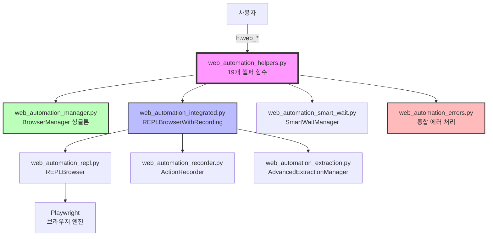

# 웹 자동화 시스템 최종 구조 (8개 모듈)

## 📊 모듈별 크기 및 복잡도

| 모듈 | 크기 (KB) | 클래스 | 함수 | 역할 |
|------|-----------|---------|------|------|
| helpers | 30.1 | 0 | 41 | 사용자 API |
| integrated | 25.3 | 1 | 0 | 통합 인터페이스 |
| manager | 14.4 | 2 | 0 | 인스턴스 관리 |
| smart_wait | 11.7 | 1 | 1 | 대기 전략 |
| extraction | 8.7 | 1 | 0 | 데이터 추출 |
| recorder | 8.7 | 1 | 0 | 액션 기록 |
| repl | 8.6 | 1 | 1 | 브라우저 제어 |
| errors | 8.5 | 3 | 3 | 에러 처리 |
| **합계** | **113.0** | **10** | **46** | - |

## 🔄 데이터 흐름

1. **사용자 → 헬퍼 함수**: `h.web_start()`, `h.web_goto()` 등
2. **헬퍼 → Manager**: 브라우저 인스턴스 관리
3. **헬퍼 → Integrated**: 통합 브라우저 객체 생성
4. **Integrated → 하위 모듈들**: 실제 작업 수행
5. **모든 액션 → Recorder**: 자동 기록
6. **결과 → 사용자**: 데이터 반환 및 스크립트 생성
