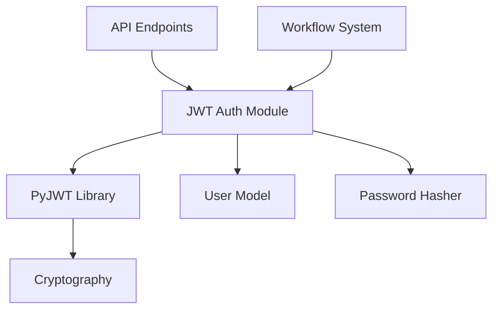

# 🎨 태스크 설계서

## 📋 기본 정보
- **프로젝트**: ai-coding-brain-mcp
- **플랜**: jwt_auth_system
- **태스크**: JWT 토큰 발급 API 구현
- **작성일**: 2025-07-13
- **작성자**: AI Assistant

## 🎯 설계 목적
### 요구사항
JWT(JSON Web Token) 기반의 안전한 사용자 인증 시스템을 구현하여, 
API 엔드포인트에 대한 접근 제어와 사용자 세션 관리를 제공한다.

### AI의 이해
이 태스크는 사용자 인증을 위한 JWT 토큰 발급 시스템을 구현하는 것입니다.
JWT는 서버리스 환경에서도 사용 가능한 stateless 인증 방식으로,
토큰 자체에 사용자 정보를 안전하게 포함시킬 수 있습니다.

### 해결하려는 문제
1. 사용자 인증 정보의 안전한 관리
2. API 접근 권한 제어
3. 세션 관리의 확장성 문제
4. 토큰 만료 및 갱신 처리

## 🔍 현재 시스템 분석
### 관련 모듈
```python
# 영향받는 주요 모듈
- python/api/ (새로 생성될 위치)
- python/workflow/ (인증이 필요한 워크플로우)
- python/ai_helpers/api/ (API 관리 시스템과 통합)
```

### 의존성 맵


## 💡 구현 방향
### 접근 방법
1. **모듈화된 구조**: `python/api/auth/` 디렉토리에 인증 관련 모듈 구성
2. **보안 우선**: 비밀번호 해싱, 토큰 암호화, 시크릿 키 관리
3. **확장 가능성**: 추후 OAuth2, SSO 등 추가 가능한 구조
4. **테스트 주도**: 모든 인증 로직에 대한 단위 테스트 작성

### 주요 변경사항
1. `python/api/auth/` 디렉토리 생성
2. `jwt_handler.py` - JWT 토큰 생성/검증 로직
3. `user_auth.py` - 사용자 인증 로직
4. `decorators.py` - 인증 데코레이터
5. `config.py` - 인증 설정 관리

### 코드 구조
```python
# 제안하는 구조
python/api/auth/
├── __init__.py
├── jwt_handler.py      # JWT 토큰 관리
├── user_auth.py        # 사용자 인증 로직
├── decorators.py       # @require_auth 등의 데코레이터
├── config.py           # JWT 설정 (시크릿 키, 만료 시간 등)
└── models.py           # User 모델 정의
```

## ⚠️ 영향도 분석
### 직접 영향
- **변경 파일**: 없음 (새로 생성)
- **새 파일**: 
  - `python/api/auth/__init__.py`
  - `python/api/auth/jwt_handler.py`
  - `python/api/auth/user_auth.py`
  - `python/api/auth/decorators.py`
  - `python/api/auth/config.py`
- **삭제 파일**: 없음

### 간접 영향
- **API 변경**: 새로운 인증 엔드포인트 추가 (/auth/login, /auth/refresh)
- **데이터베이스**: User 테이블 필요 (추후 구현)
- **성능**: JWT 검증으로 인한 약간의 오버헤드 (무시 가능)

### 하위 호환성
새로운 기능 추가이므로 기존 코드에 영향 없음.
opt-in 방식으로 필요한 엔드포인트에만 인증 적용.

## 🛡️ 리스크 관리
| 리스크 | 가능성 | 영향도 | 대응 방안 |
|--------|--------|--------|-----------|
| 시크릿 키 노출 | 낮음 | 높음 | 환경 변수 사용, .gitignore 설정 |
| 토큰 탈취 | 중간 | 높음 | HTTPS 강제, 짧은 만료 시간 |
| 무차별 대입 공격 | 낮음 | 중간 | Rate limiting 구현 |

## 📊 예상 결과
### 성공 기준
- [ ] JWT 토큰 생성 API 구현 완료
- [ ] 토큰 검증 미들웨어 작동
- [ ] 토큰 갱신 메커니즘 구현
- [ ] 모든 테스트 통과 (coverage 90% 이상)

### 예상 소요 시간
- 구현: 2시간
- 테스트: 1시간
- 문서화: 30분

## ✅ 검증 계획
### 단위 테스트
```python
# 테스트 계획
- test_jwt_generation(): 토큰 생성 테스트
- test_jwt_validation(): 유효한 토큰 검증
- test_jwt_expiration(): 만료된 토큰 처리
- test_jwt_invalid(): 잘못된 토큰 거부
- test_auth_decorator(): 인증 데코레이터 동작
```

### 통합 테스트
1. 로그인 → 토큰 발급 → API 호출 → 토큰 갱신 전체 플로우
2. 동시 다중 사용자 인증 처리
3. 토큰 만료 시나리오

## 📚 참고 자료
- JWT 공식 문서: https://jwt.io/
- PyJWT 문서: https://pyjwt.readthedocs.io/
- OWASP 인증 가이드라인
