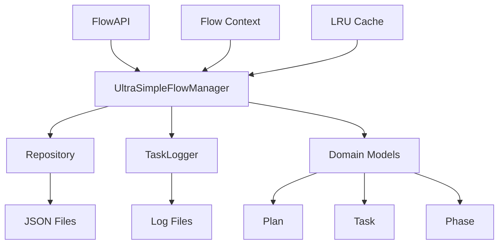

# Flow System Architecture

## 시스템 아키텍처



## 데이터 플로우

1. **API 호출** → FlowAPI
2. **비즈니스 로직** → UltraSimpleFlowManager
3. **데이터 저장** → Repository
4. **로깅** → TaskLogger
5. **응답 반환** → Client

## 파일 구조

```
.ai-brain/flow/
├── flow_data.json       # 플랜 데이터
├── flow_state.json      # 시스템 상태
├── plans/               # 플랜별 디렉토리
│   └── plan_xxx/
│       ├── tasks.json   # 태스크 목록
│       └── logs/        # 태스크 로그
└── logs/                # 시스템 로그
```
